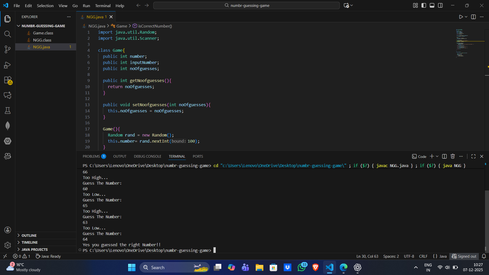

# Number Guessing Game

## Description
A simple Java program where the user has to guess a randomly generated number between 1 and 100.  
The program tells if the guessed number is too high or too low until the correct number is guessed.

## How to Run
1. Make sure Java is installed.
2. Compile the program:
```bash
javac NGG.java


```
## Run the Program

java NGG

## Features

-Random number generation between 1 and 100
-User input for guesses
-Hints if the guess is too high or too low

## Screenshots


## Author
Nikhil Kumar Mishra
